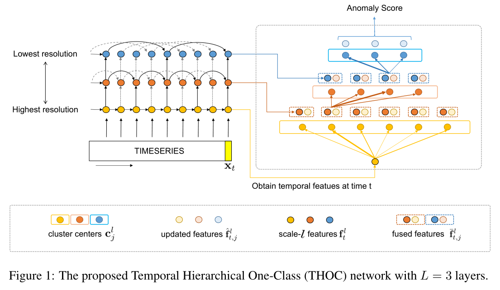

### Timeseries Anomaly Detection using Temporal Hierarchical One-Class Network阅读笔记
基于时态分层网络的单类时间序列异常检测

提出模型用于解决时间序列的异常检测，前人使用单分类来做异常检测，假设大多数数据是正常的（符合实际生活），那么我们对于时间序列进行预测，如果预测值和现实值差距过大，那么就称该值为离群值。也就是可能的异常值。

两个著名的方法分别是单类支持向量机（OS-SVM）,和支持向量描述（SVDD）。都是基于支持向量机模型，我认识一方面支持向量机处理此类问题可以利用核函数，将输入特征映射到高纬度，另一方面，由于异常数据一般是稀缺的，而支持向量机只与支持向量的分布有关，所以可以减少异常数据过少的影响。

在此基础上，由于深度学习的发展，考虑将核函数部分转换为深度学习网络，通过网络提取出输入序列的特征。通过这种思想提出了深度SVDD、DAGMM和GMM。由于提取特征之后需要通过向量机算法寻找超球体，将正常数据包含在球体当中，而这个操作是没有梯度的，所以如果要训练，需要额外处理。设损失函数为：
```math
min_{R,W} R^2+\frac{1}{vn}\sum_{i=1}^n \max \{0,||NN(x_i,W)-c||^2-R^2\}+\frac{\lambda}{2}\sum_{l=1}^L||W^l||^2_F
```
第一项是希望超球体的半径尽可能小，也就是正常数据的分布尽可能紧凑，得以更好的区分异常数据。第二项则是对所有在外部的点一个惩罚值，第三项是对于W进行正则化。$v$和$\lambda$为超参数，用以平衡三项的侧重程度。

在训练的方式上，由于求超球体球心的过程很难计算梯度，所以先假定一个圆心和半径，若圆心和半径是定量，那么其他项的计算都是有梯度的，就可以训练了。每训练一定的轮次就重新计算一次圆心和半径。我们可以通过训练自编码器，然后通过编码网络的均值确定圆心和半径的初值。若网络参数都为0，那么圆心和半径都会为0，这种现象称为超球塌陷。可以通过增加偏移量的方式避免。

本文提出使用时间层次单类网络（THOC）来提取特征，利用跳跃连接的循环时间网络RNN。传统的RNN只能获得最低分辨率特征，所以要提取多时间尺度的特征。



如上图所示，通过网络可以提取到不同时间尺度的特征，具体计算公式为：
```math
f^l_t=
\left\{ \begin{aligned}
    & F_{RNN}(x_t,f^l_{t-s^{(l)}})  & if \ l=1 \\
    & F_{RNN}(f^{l-1}_t,f^l_{t-s^{(l)}})  & otherwise
\end{aligned}\right.
```
具体的间隔设置为$s^{(l)} = M_0\prod _{i=1}^{l-1}M$。一般$M_0=1$,$M=2$。

之后需要进行多尺度特征的融合。
